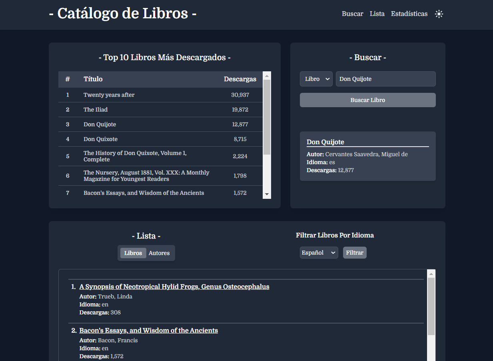
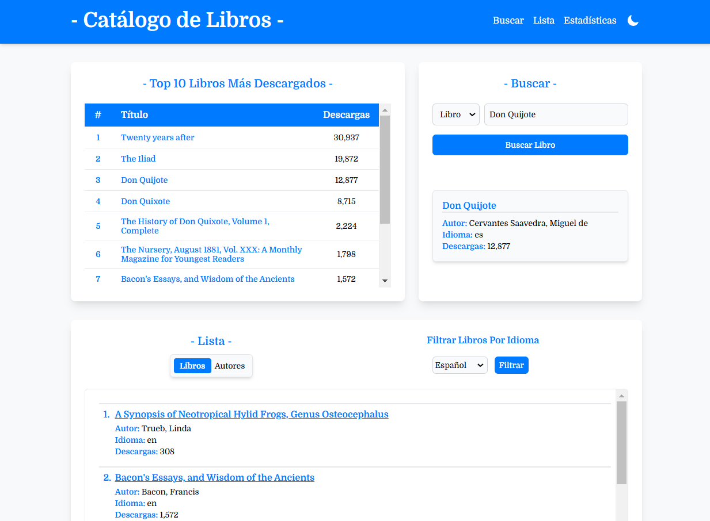

# Catálogo de Libros API


[](https://gutendex.com)


# Índice

1. [Descripción](#descripción)
2. [Características](#características)
3. [Tecnologías](#tecnologías)
4. [Dependencias](#dependencias)
5. [Requisitos](#requisitos)
6. [Instalación](#instalación)
7. [Uso](#uso)
8. [Frontend](#frontend)
9. [Licencia](#licencia)
10. [Autor](#autor)

## Descripción

Catálogo de Libros es una aplicación Java diseñada para funcionar tanto en consola como como una API REST, centrada en la gestión de información sobre libros. Desarrollada con Spring Boot y empleando MySQL como sistema de gestión de bases de datos, esta aplicación se conecta a una API externa para buscar información sobre libros. Los datos obtenidos se almacenan en la base de datos, lo que permite su visualización a través de la API.

La aplicación facilita la consulta de libros y autores almacenados, proporcionando estadísticas y consultas adicionales. Además, está diseñada para ser utilizada junto a un frontend en React.

## Características

- **Funcionamiento Dual**: La aplicación puede operar tanto en modo consola como a través de una API REST.
- **Conexión a API Externa**: Se conecta a una API externa para buscar información sobre libros y autores.
- **Almacenamiento de Datos**: Los datos obtenidos se almacenan en una base de datos MySQL, lo que facilita su recuperación y visualización.
- **Consulta de Información**: Ofrece funcionalidades para consultar libros y autores almacenados, así como estadísticas y consultas adicionales.
- **Integración con Frontend**: Diseñada para ser utilizada en conjunto con un frontend en React, facilitando la comunicación entre ambos componentes.

## Tecnologías

- **Java**: Lenguaje de programación principal utilizado para la lógica del backend.
- **Spring Boot**: Framework que facilita el desarrollo ágil de aplicaciones en Java, permitiendo una configuración mínima.
- **MySQL**: Sistema de gestión de bases de datos relacional utilizado para almacenar la información de los libros.
- **API REST**: Protocolo de comunicación que permite realizar operaciones de consulta sobre los datos almacenados.
- **Springdoc OpenAPI**: Biblioteca para la generación automática de documentación de la API en aplicaciones Spring Boot, que utiliza **Swagger UI** para visualizar y probar los endpoints de manera interactiva.

## Gutendex API

La aplicación utiliza la API de [Gutendex](https://gutendex.com/) para obtener información sobre libros. Para utilizar esta API, asegúrate de seguir los siguientes pasos:

1. **Registro**:
    - No es necesario registrarse para acceder a la API de Gutendex, ya que es de acceso público.

2. **Realización de Solicitudes**:
    - La aplicación envía solicitudes HTTP GET a la API para buscar libros. Por ejemplo, puedes realizar una solicitud utilizando la siguiente URL:
      ```
      https://gutendex.com/books/?search=tu_búsqueda
      ```
    - Esto devolverá un JSON con la información sobre los libros que coinciden con la búsqueda.

3. **Manejo de la Respuesta**:
    - El programa procesa la respuesta JSON para extraer los detalles relevantes de los libros, como el título, autor e idioma. Esta información se almacena en la base de datos para su posterior visualización.

4. **Ejemplo de Respuesta**:
    - La respuesta de la API podría verse algo así:
      ```json
        {
          "count": 7,
          "results": [
            {
              "id": 2000,
              "title": "Don Quijote",
              "authors": [
                {
                  "name": "Cervantes Saavedra, Miguel de",
                  "birth_year": 1547,
                  "death_year": 1616
                }
              ],
              "languages": [
                "es"
              ],
              "download_count": 12877
            }
          ]
        }
      ```

Al utilizar esta API, la aplicación puede proporcionar información precisa y actualizada sobre una amplia variedad de libros.

## Dependencias

Para que el **Catálogo de Libros** funcione correctamente, asegúrate de incluir las siguientes dependencias en tu proyecto:

- **Spring Boot Starter Data JPA**: Para la integración con Hibernate.
- **Spring Boot Starter Web**: Para la creación de la API REST.
- **MySQL Connector/J**: Para la conexión con la base de datos MySQL.
- **Jackson Databind**: Para la manipulación de JSON.
- **Spring Boot DevTools**: Para el desarrollo y la recarga automática en tiempo de ejecución (opcional).
- **Springdoc OpenAPI Starter**: Para la generación de documentación de la API con Swagger.
- **Dotenv Java**: Para la carga de variables de entorno desde un archivo `.env`.

Asegúrate de agregar las dependencias en el archivo `pom.xml` de tu proyecto Maven.

## Requisitos

- JDK 21
- Maven
- IntelliJ IDEA (o cualquier otro IDE compatible con Java)
## Instalación

1. Clona este repositorio:
   ```bash
   git clone https://github.com/william-medina/catalogo-libros-api.git
   ```

2. Navega al directorio del proyecto:
   ```bash
   cd catalogo-libros-api
   ```

3. **Crea un archivo `.env`:**

   Crea un archivo `.env` en la raíz del directorio del proyecto y rellénalo con las variables de entorno necesarias. Aquí tienes una plantilla que puedes usar:

    ```dotenv
    # Cadena de conexión a la base de datos (MySQL)
    DB_URL=jdbc:mysql://localhost:3306//your_database_name

    # Nombre de usuario para conectarse a la base de datos
    DB_USERNAME=your_username  
   
    # Contraseña del usuario de la base de datos
    DB_PASSWORD=your_password      

    # URL del Frontend (Opcional) - Habilita CORS para permitir peticiones desde esta URL.
    FRONTEND_URL=http://localhost:3000
    ```
   Reemplaza los valores de ejemplo con los detalles de tu configuración real.


4. Asegúrate de que todas las dependencias estén instaladas utilizando la opción de **"Actualizar Proyecto"** o **"Importar dependencias"** en tu IDE.


## Uso

### Modo Consola

1. **Ejecuta la Aplicación**:
    - Para iniciar la aplicación en modo consola, ejecuta la clase `ConsoleApplication` desde tu IDE o desde la línea de comandos. Esta clase contiene el método `main`, que inicia la aplicación. Al ejecutarla, se iniciará la API REST y, además, se mostrará el menú del programa en la consola para que puedas interactuar y probar las funcionalidades disponibles.

2. **Menú de Conversión**:
    - Una vez iniciada la aplicación, verás el siguiente menú:
      ```
       ******************************************************
       ***               CATÁLOGO DE LIBROS               ***
       ******************************************************
 
       Selecciona una opción:
       ------------------------------------------------------
       | 1) Buscar libro por título                         |
       | 2) Ver todos los libros                            |
       | 3) Ver todos los autores                           |
       | 4) Autores vivos en un año específico              |
       | 5) Libros por idioma                               |
       | 6) Top 10 libros más descargados                   |
       | 7) Buscar autor por nombre                         |
       | 8) Ver estadísticas                                |
       | 9) Salir                                           |
       ------------------------------------------------------
       Ingrese su opción:
      ```

3. **Selecciona una Opción**:
    - Ingresa el número correspondiente a la opción deseada y presiona **Enter**.

4. **Buscar Libro o Autor**:
    - Si eliges una de estas opciones, se te pedirá que ingreses el título del libro o el nombre del autor. En el caso de buscar un libro, primero se realizará una consulta a la API de [Gutendex](https://gutendex.com/) para buscar el libro y posteriormente se almacenará en la base de datos. Si buscas un autor, la búsqueda se realizará únicamente en la base de datos.

5. **Ver Todos los Libros o Autores**:
    - Si seleccionas estas opciones, se desplegará una lista que contendrán información sobre todos los libros o autores.

6. **Autores Vivos en un Año Específico**:
    - Si eliges esta opción, se te pedirá que ingreses un año determinado para buscar los autores que estaban vivos en ese año.

7. **Libros por Idioma**:
    - Si seleccionas esta opción, se te pedirá que ingreses el código del idioma del libro que deseas filtrar (por ejemplo, "es" para español, "en" para inglés).

### Modo API

1. **Ejecuta la Aplicación**:
    - Para iniciar la aplicación en modo API, ejecuta la clase `ApiApplication` desde tu IDE o en la línea de comandos. Esta clase contiene el método `main`, que inicia la aplicación exclusivamente en modo web.

2. **Acceso a la API REST**:
    - Una vez que la aplicación esté en ejecución, podrás acceder a la API REST a través de la URL base:
      ```
      http://localhost:8080/api
      ```
    - Asegúrate de que el puerto configurado en tu aplicación sea el correcto (por defecto, es 8080).

3. **Endpoints Disponibles**:
   - A continuación se muestran los endpoints disponibles:

   | **Descripción**                              | **Método** | **URL**         |
   |----------------------------------------------|------------|-----------------|
   | Ver todos los libros                        | `GET`      | `/book`         |
   | Buscar libro por título                     | `GET`      | `/book/search/{title}` |
   | Libros por idioma                           | `GET`      | `/book/language/{language}` |
   | Top 10 libros más descargados               | `GET`      | `/book/top10`   |
   | Obtener estadísticas de los libros          | `GET`      | `/book/statistics` |
   | Ver todos los autores                       | `GET`      | `/author`       |
   | Buscar autor por nombre                     | `GET`      | `/author/search/{name}` |
   | Autores vivos en un año específico          | `GET`      | `/author/active/{year}` |

4. **Formato de Respuesta**:
    - La API devuelve respuestas en formato JSON. Aquí tienes ejemplos de respuestas al buscar un libro y un autor:

   **Respuesta al buscar un libro:**
     ```json
     {
       "id": 1,
       "title": "Don Quijote",
       "author": "Cervantes Saavedra, Miguel de",
       "language": "es",
       "downloadCount": 12877
     }
     ```
   **Respuesta al buscar un autor:**
     ```json
     {
       "id": 1,
       "name": "Cervantes Saavedra, Miguel de",
       "birthYear": 1547,
       "deathYear": 1616,
       "books": [
         "Don Quijote",
         "Don Quixote",
         "The History of Don Quixote, Volume 1, Complete"
       ]
     }
     ```

5. **Documentación de la API**:
    - La documentación de la API está disponible a través de [Swagger UI](http://localhost:8080/api/docs/swagger-ui/index.html) una vez que la aplicación esté en funcionamiento. Esta herramienta te permite explorar todos los endpoints disponibles y realizar pruebas directamente desde tu navegador, facilitando la interacción con la API.
   ```
   http://localhost:8080/api/docs/swagger-ui/index.html
   ```

## Frontend

La aplicación cuenta con un frontend desarrollado en **React** utilizando **TypeScript** y **Tailwind CSS**. Este frontend está diseñado para interactuar de manera efectiva con la API.

#### Acceso al Repositorio
El código fuente está disponible en el siguiente enlace:

👉 [Repositorio del Frontend en GitHub](https://github.com/william-medina/catalogo-libros-app)

#### Características Destacadas del Frontend
- **Interfaz Responsiva**: Diseñada para ofrecer una experiencia de usuario fluida en dispositivos móviles y de escritorio.
- **Conexión Eficiente a la API**: Permite la interacción en tiempo real con la API REST, facilitando búsquedas y visualización de datos de manera ágil.
- **Componentes Reutilizables**: Estructura modular que simplifica el mantenimiento y la escalabilidad de la aplicación.

#### Imágenes del Frontend


A continuación, se presentan algunas capturas de pantalla del frontend en diferentes modos:

**Modo Oscuro:**


**Modo Claro:**


## Licencia

Este proyecto está bajo la Licencia MIT. Para más detalles, consulta el archivo [LICENSE](./LICENSE).

## Autor

**William Medina**  
Autor y desarrollador del **Catálogo de Libros API**. Puedes encontrarme en [GitHub](https://github.com/william-medina)